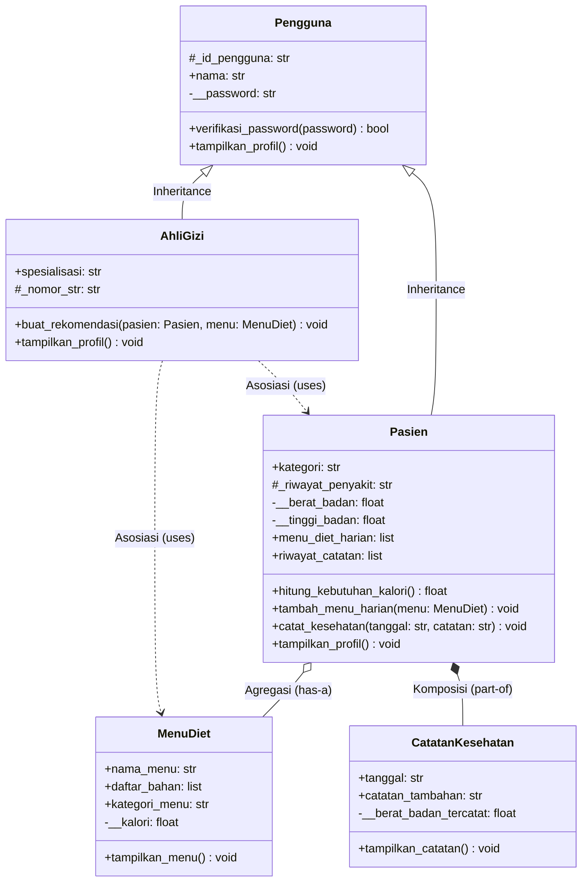

# Sistem Informasi Gizi

**Nama:** Muhammad Zaki Fahriansyah  
**NIM:** 2509106020  
**Kelas:** A1'25  

Post-test Praktikum Pemrograman Berorientasi Objek — mengimplementasikan konsep **Class & Object**, **Atribut & Method** (instance, class, static), **Encapsulation & Property**, serta **Inheritance & Relasi UML** pada studi kasus sebuah klinik gizi.

## Deskripsi Program

Program ini mengelola data pasien, ahli gizi, menu diet, dan catatan kesehatan pada sebuah klinik gizi. Setiap class saling berinteraksi melalui objek — misalnya `AhliGizi` menerima objek `Pasien` dan `MenuDiet` untuk membuat rekomendasi, sedangkan `CatatanKesehatan` menyimpan objek `Pasien` sebagai salah satu atributnya. 

*Catatan: Pada Post-test 4, program ini telah diperbarui dari yang awalnya berdiri sendiri menjadi menggunakan konsep Pewarisan (Inheritance) dan Relasi antar Class (Asosiasi, Agregasi, dan Komposisi).*

---

## Struktur Class

### 1. `Pengguna` (Superclass)
Class induk untuk entitas pengguna sistem (Pasien dan Ahli Gizi).
- **Atribut public**: `nama`
- **Atribut protected**: `_id_pengguna`
- **Atribut private**: `__password`
- **Method**: `verifikasi_password()`, `tampilkan_profil()`

### 2. `Pasien` (Subclass dari `Pengguna`)
Menyimpan data pasien klinik gizi.
- **Atribut kelas**: `nama_klinik`, `total_pasien`, `kategori_valid`
- **Atribut public**: `kategori`
- **Atribut protected**: `_riwayat_penyakit`
- **Atribut private**: `__berat_badan`, `__tinggi_badan`
- **Property (getter/setter)**: `berat_badan`, `tinggi_badan`, `riwayat_penyakit`
- **Wadah Relasi**: `menu_diet_harian` (List), `riwayat_catatan` (List)
- **Method Overriding**: `tampilkan_profil()`
- **Method Relasi**: `tambah_menu_harian()` (Agregasi), `catat_kesehatan()` (Komposisi)

### 3. `AhliGizi` (Subclass dari `Pengguna`)
Menyimpan data ahli gizi yang bertugas di klinik.
- **Atribut kelas**: `total_ahli_gizi`, `spesialisasi_valid`
- **Atribut public**: `spesialisasi`
- **Atribut protected**: `_nomor_str`
- **Method Overriding**: `tampilkan_profil()`
- **Method Relasi**: `buat_rekomendasi()` (Asosiasi)

### 4. `MenuDiet`
Menyimpan data menu diet yang disusun oleh ahli gizi.
- **Atribut public**: `nama_menu`, `daftar_bahan`, `kategori_menu`
- **Atribut private**: `__kalori`
- **Property (getter/setter)**: `kalori`
- **Method**: `tampilkan_menu()`

### 5. `CatatanKesehatan`
Mencatat riwayat pemeriksaan kesehatan seorang pasien.
- **Atribut public**: `pasien`, `tanggal`, `catatan_tambahan`
- **Atribut private**: `__berat_badan_tercatat`
- **Property (getter/setter)**: `berat_badan_tercatat`
- **Method**: `tampilkan_catatan()`

---

## Diagram Class UML

Berikut adalah representasi visual dari arsitektur class yang dibuat, menampilkan Pewarisan dan Relasi antar class:



---

## Penerapan Inheritance / Pewarisan
Untuk menghindari pengulangan deklarasi atribut dasar pengguna, diterapkan konsep Pewarisan:
1. Superclass & Subclass: Dibuat class induk bernama Pengguna. Class Pasien dan AhliGizi bertindak sebagai Subclass.
2. Penggunaan super(): Konstruktor pada Pasien dan AhliGizi menggunakan fungsi super().__init__(id_pengguna, nama, password) untuk memanggil dan menginisialisasi atribut inti dari superclass.
3. Atribut Spesifik Subclass: Pasien memiliki atribut tambahan medis (kategori, berat_badan, dsb), sedangkan AhliGizi memiliki atribut profesi (spesialisasi, nomor_str).
4. Method Overriding: Method tampilkan_profil() yang mulanya di-deklarasikan secara abstrak pada class Pengguna, di-override dan didefinisikan ulang logikanya pada subclass.
5. Akses Protected & Private:
   - Protected (_): Atribut _id_pengguna dan _riwayat_penyakit dapat dimanipulasi oleh subclass.
   - Private (__): Atribut __password di superclass dikunci agar tidak terekspos ke subclass, hanya bisa divalidasi lewat internal method verifikasi_password().

## Penerapan Relasi UML
Program ini mengimplementasikan tiga jenis relasi struktural antar objek sesuai kaidah UML:
1. Asosiasi (Association)
   Diimplementasikan pada method buat_rekomendasi(self, pasien, menu) dalam class AhliGizi. Class ini berinteraksi dengan objek Pasien dan MenuDiet secara independen tanpa kepemilikan mutlak.
2. Agregasi (Aggregation)
   Diimplementasikan pada method tambah_menu_harian() dalam class Pasien. Objek MenuDiet dibuat secara mandiri di luar, lalu dimasukkan ke dalam atribut list Pasien. Jika objek Pasien dihapus, data menu diet tetap ada.
3. Komposisi (Composition)
   Diimplementasikan pada method catat_kesehatan() dalam class Pasien. Objek CatatanKesehatan diinisialisasi secara mutlak di dalam internal method milik Pasien sehingga sangat bergantung (dependen) pada eksistensi induknya.

## Penerapan Encapsulation
Semua data medis dan data sensitif disimpan sebagai atribut private (__nama_atribut) dan hanya dapat diakses/diubah melalui getter (@property) dan setter (@nama_properti.setter) yang dilengkapi validasi. Jika input salah (misal: negatif), setter menolak perubahan sehingga nilai lama tetap aman. Password tidak memiliki getter dan hanya divalidasi mengembalikan nilai Boolean True/False.

---

## Cara Menjalankan Program

```bash
python 2509106020-MuhammadZakiFahriansyah-PT-1.py
# atau (untuk pengguna Linux/macOS):
python3 2509106020-MuhammadZakiFahriansyah-PT-1.py
```
Seluruh proses pembuatan objek, pemanggilan method, dan pengujian setter otomatis dijalankan di bagian `if __name__ `== `"__main__"`: tanpa memerlukan input manual.

---

### Cuplikan Output Pengujian (Terminal)

```text
SISTEM INFORMASI GIZI - DEMONSTRASI PROGRAM
============================================================

[1] Membuat objek Pasien & Uji Overriding
--- Profil Pasien: Dimas (P001) ---
Kategori     : reguler
Berat Badan  : 70 kg
Tinggi Badan : 170 cm
Riwayat      : Tidak ada
Klinik       : Klinik Gizi Sehat Samarinda
--- Profil Pasien: Rina (P002) ---
Kategori     : kondisi_medis
Berat Badan  : 55 kg
Tinggi Badan : 160 cm
Riwayat      : Diabetes
Klinik       : Klinik Gizi Sehat Samarinda

[2] Membuat objek AhliGizi
--- Profil Ahli Gizi: dr. Sari (A001) ---
Spesialisasi : gizi_klinik
Nomor STR    : STR12345

[3] Membuat objek MenuDiet

[4] Uji Relasi Asosiasi (buat_rekomendasi)
Kebutuhan kalori Dimas (reguler): 2310 kkal/hari
Kebutuhan kalori Dimas (reguler): 2310 kkal/hari
--- Rekomendasi dari dr. Sari (gizi_klinik) ---
Menu 'Nasi Merah + Ayam Panggang' (550 kkal) SESUAI untuk Dimas.

[5] Uji Relasi Agregasi (Pasien & MenuDiet)
Menu Nasi Merah + Ayam Panggang ditambahkan ke daftar Dimas.
Menu Oatmeal Buah ditambahkan ke daftar Dimas.

[6] Uji Relasi Komposisi (Pasien & CatatanKesehatan)
Catatan kesehatan Dimas pada 01-09-2026 berhasil dibuat.
--- Catatan Kesehatan: Dimas (01-09-2026) ---
Berat Badan Tercatat : 70 kg
Catatan Tambahan     : Kondisi stabil

[7] Uji Class & Static Method
Total pasien terdaftar    : 2
Validasi kategori 'atlet' : True

[8] Uji Setter (Encapsulation)
Berat badan Dimas setelah diubah: 72 kg
[Gagal] Berat badan Dimas tidak valid: harus lebih dari 0.

[9] Uji Inheritance (Akses Method Superclass - Private Data)
Password 'pass123' untuk Dimas benar? True

============================================================
DEMONSTRASI SELESAI
============================================================
```
---

## Struktur Repositori

```
.
praktikum-pbo/
├── kelas/
└── post-test/
    └── post-test-1/
        ├── 2509106020-MuhammadZakiFahriansyah-PT-1.py   # Program utama
        └── README.md                                    # Dokumentasi post-test 1
    └── post-test-2/
        ├── 2509106020-MuhammadZakiFahriansyah-PT-2.py   # Program utama
        └── README.md                                    # Dokumentasi post-test 2
```