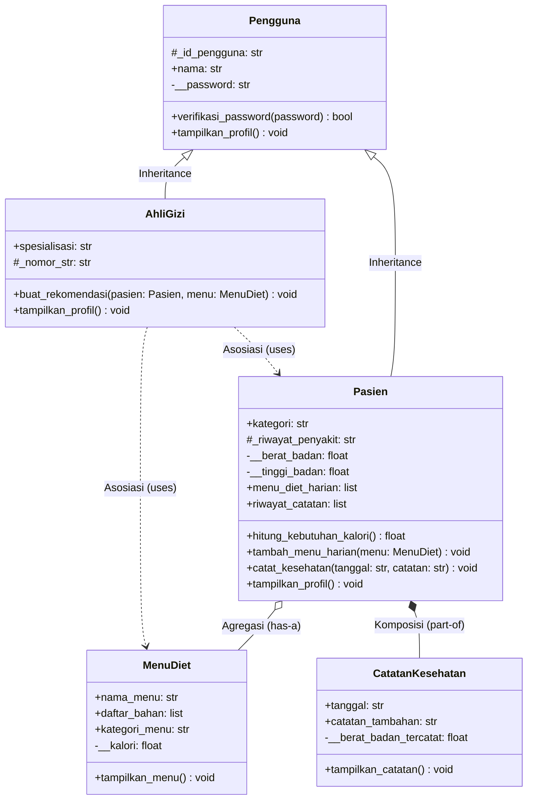

# Sistem Informasi Gizi

**Nama:** Muhammad Zaki Fahriansyah  
**NIM:** 2509106020  
**Kelas:** A1'25  

Post-test Praktikum Pemrograman Berorientasi Objek — mengimplementasikan konsep **Class & Object**, **Atribut & Method** (instance, class, static), **Encapsulation & Property**, serta **Inheritance & Relasi UML** pada studi kasus sebuah klinik gizi.

## Deskripsi Program

Program ini mengelola data pasien, ahli gizi, menu diet, dan catatan kesehatan
pada sebuah klinik gizi. Setiap class berdiri sendiri (tidak menggunakan
inheritance) dan saling berinteraksi melalui objek — misalnya `AhliGizi`
menerima objek `Pasien` dan `MenuDiet` untuk membuat rekomendasi, sedangkan
`CatatanKesehatan` menyimpan objek `Pasien` sebagai salah satu atributnya.

---

## Struktur Class

### 1. `Pasien`
Menyimpan data pasien klinik gizi.

- **Atribut kelas**: `nama_klinik`, `total_pasien`, `kategori_valid`
- **Atribut public**: `id_pasien`, `nama`, `kategori`
- **Atribut private**: `__password`, `__berat_badan`, `__tinggi_badan`, `__riwayat_penyakit`
- **Property (getter/setter)**: `berat_badan`, `tinggi_badan`, `riwayat_penyakit`
  - Validasi: berat/tinggi badan harus > 0, riwayat penyakit tidak boleh kosong
- **Instance method**: `hitung_kebutuhan_kalori()`, `tampilkan_profil()`, `verifikasi_password()`
- **Class method**: `dari_dict()` (factory method), `ganti_nama_klinik()`
- **Static method**: `validasi_kategori()`

### 2. `AhliGizi`
Menyimpan data ahli gizi yang bertugas di klinik.

- **Atribut kelas**: `total_ahli_gizi`, `spesialisasi_valid`
- **Atribut public**: `id_ahli`, `nama`, `spesialisasi`
- **Atribut private**: `__password`, `__nomor_str`
- **Property (getter/setter)**: `nomor_str`
  - Validasi: minimal 6 karakter dan tidak boleh kosong
- **Instance method**: `buat_rekomendasi()` (menerima objek `Pasien` dan `MenuDiet`), `verifikasi_password()`
- **Class method**: `dari_dict()` (factory method)
- **Static method**: `validasi_spesialisasi()`

### 3. `MenuDiet`
Menyimpan data menu diet yang disusun oleh ahli gizi.

- **Atribut kelas**: `total_menu`, `kategori_menu_valid`
- **Atribut public**: `nama_menu`, `daftar_bahan`, `kategori_menu`
- **Atribut private**: `__kalori`
- **Property (getter/setter)**: `kalori`
  - Validasi: harus berupa angka dan lebih dari 0
- **Instance method**: `tampilkan_menu()`
- **Class method**: `dari_dict()` (factory method)
- **Static method**: `validasi_kalori()`

### 4. `CatatanKesehatan`
Mencatat riwayat pemeriksaan kesehatan seorang pasien pada kunjungan tertentu.

- **Atribut kelas**: `total_catatan`, `format_tanggal`
- **Atribut public**: `pasien` (objek `Pasien`), `tanggal`, `catatan_tambahan`
- **Atribut private**: `__berat_badan_tercatat`
- **Property (getter/setter)**: `berat_badan_tercatat`
  - Validasi: harus > 0
- **Instance method**: `tampilkan_catatan()`
- **Class method**: `rekap_total()`
- **Static method**: `validasi_format_tanggal()`

## Penerapan Encapsulation

Semua data fisik/medis dan data sensitif (berat badan, tinggi badan, riwayat
penyakit, password, nomor STR, kalori menu) disimpan sebagai atribut **private**
(`__nama_atribut`) dan hanya dapat diakses/diubah melalui **getter** (`@property`)
dan **setter** (`@nama_properti.setter`) yang sudah dilengkapi validasi. Jika
data yang dimasukkan tidak valid (misalnya angka negatif atau string kosong),
setter akan menolak perubahan dan mencetak pesan peringatan, sehingga nilai
lama tetap dipertahankan.

Password tidak diberi getter sama sekali — hanya bisa diperiksa lewat method
`verifikasi_password()` yang mengembalikan `True`/`False`, tanpa pernah
mengekspos nilai aslinya ke luar class.

---

## Diagram Class UML

Berikut adalah representasi visual dari arsitektur class yang dibuat, menampilkan Pewarisan dan Relasi antar class:



---

### 1. Relasi UML

| Relasi | Kata Kunci | Lokasi di Program | Penjelasan |
|---|---|---|---|
| **Asosiasi** | "menggunakan" | `AhliGizi.buat_rekomendasi(pasien, menu)` | Objek `Pasien` dan `MenuDiet` diterima sebagai parameter method, dipakai sementara untuk menyusun rekomendasi, dan tidak pernah disimpan sebagai atribut permanen milik `AhliGizi`. |
| **Agregasi** | "memiliki" | `AhliGizi._daftar_pasien_binaan` + `tambah_pasien_binaan()` / `tampilkan_pasien_binaan()` | Objek `Pasien` dibuat **di luar** `AhliGizi`, lalu didaftarkan ke dalam list `_daftar_pasien_binaan`. Jika objek `AhliGizi` dihapus, objek `Pasien` tetap ada secara independen (tidak ikut musnah). |
| **Komposisi** | "terdiri dari" | `Pasien._riwayat_kesehatan` + `catat_riwayat_kesehatan()` / `tampilkan_riwayat_kesehatan()` | Objek `CatatanKesehatan` dibuat **langsung di dalam** method milik `Pasien` (bukan dibuat lalu dikirim dari luar). Siklus hidup catatan menyatu dengan `Pasien` pemiliknya. |

### 2. Inheritance

Ditambahkan superclass baru **`User`** yang menaungi dua subclass: **`Pasien`**
dan **`AhliGizi`**. Keduanya lolos uji *is-a* ("Pasien adalah User", "AhliGizi
adalah User"), sehingga inheritance memang relasi yang tepat digunakan di sini.

**Superclass `User`**
- Atribut public: `nama`
- Atribut protected: `_status_aktif` — sengaja dibuat protected (bukan private)
  karena subclass (`Pasien`) perlu membacanya langsung di method `info_dasar()`.
- Atribut private: `__password` — benar-benar rahasia/eksklusif milik `User`,
  hanya bisa diverifikasi lewat method `verifikasi_password()`, tidak bisa
  diakses langsung oleh subclass maupun dari luar class.
- Method: `verifikasi_password()`, `nonaktifkan_akun()`, `info_dasar()`

**Subclass `Pasien(User)`**
- Memanggil `super().__init__(nama, password)` di dalam `__init__`.
- Atribut spesifik/unik: `berat_badan`, `tinggi_badan`, `riwayat_penyakit`,
  `kategori`, serta `_riwayat_kesehatan` (komposisi).
- **Method overriding**: `info_dasar()` ditulis ulang untuk menampilkan
  kategori pasien sekaligus status akun, sambil mengakses atribut protected
  `_status_aktif` milik `User` secara langsung.

**Subclass `AhliGizi(User)`**
- Memanggil `super().__init__(nama, password)` di dalam `__init__`.
- Atribut spesifik/unik: `spesialisasi`, `nomor_str`, serta
  `_daftar_pasien_binaan` (agregasi).
- **Method overriding**: `nonaktifkan_akun()` ditulis ulang — selain
  menjalankan perilaku bawaan `User` lewat `super().nonaktifkan_akun()`,
  method ini juga melepas seluruh pasien binaan milik ahli gizi tersebut.

---

## Cara Menjalankan Program

```bash
python 2509106020-MuhammadZakiFahriansyah-PT-1.py
# atau (untuk pengguna Linux/macOS):
python3 2509106020-MuhammadZakiFahriansyah-PT-1.py
```
Seluruh proses pembuatan objek, pemanggilan method, dan pengujian setter otomatis dijalankan di bagian `if __name__ `== `"__main__"`: tanpa memerlukan input manual.

---

### Cuplikan Output Pengujian (Terminal)

```text
============================================================
SISTEM INFORMASI GIZI - DEMONSTRASI PROGRAM
============================================================

[1] Membuat objek Pasien
--- Profil Pasien: Dimas (P001) ---
Kategori     : reguler
Berat Badan  : 70 kg
Tinggi Badan : 170 cm
Riwayat      : Tidak ada
Klinik       : Klinik Gizi Sehat Samarinda
--- Profil Pasien: Rina (P002) ---
Kategori     : kondisi_medis
Berat Badan  : 55 kg
Tinggi Badan : 160 cm
Riwayat      : Diabetes
Klinik       : Klinik Gizi Sehat Samarinda

[2] Membuat objek AhliGizi
--- Profil Ahli Gizi: dr. Sari (A001) ---
Spesialisasi : gizi_klinik
Nomor STR    : STR12345
--- Profil Ahli Gizi: dr. Budi (A002) ---
Spesialisasi : gizi_olahraga
Nomor STR    : STR67890

[3] Membuat objek MenuDiet
--- Menu: Nasi Merah + Ayam Panggang (makan_siang) ---
Bahan  : nasi merah, ayam, brokoli
Kalori : 550 kkal
--- Menu: Oatmeal Buah (sarapan) ---
Bahan  : oatmeal, pisang, madu
Kalori : 300 kkal

[4] Uji Instance Method: hitung_kebutuhan_kalori()
Kebutuhan kalori Dimas (reguler): 2310 kkal/hari
Kebutuhan kalori Rina (kondisi_medis): 1584 kkal/hari
Kebutuhan kalori Andi (atlet): 3264 kkal/hari

Kebutuhan kalori Dimas (reguler): 2310 kkal/hari
--- Rekomendasi dari dr. Sari (gizi_klinik) ---
Menu 'Nasi Merah + Ayam Panggang' (550 kkal) SESUAI untuk Dimas.
Kebutuhan kalori Rina (kondisi_medis): 1584 kkal/hari
--- Rekomendasi dari dr. Budi (gizi_olahraga) ---
Menu 'Oatmeal Buah' (300 kkal) SESUAI untuk Rina.

[5] Membuat objek CatatanKesehatan
--- Catatan Kesehatan: Dimas (01-09-2026) ---
Berat Badan Tercatat : 70 kg
Catatan Tambahan     : Kondisi stabil
--- Catatan Kesehatan: Rina (05-09-2026) ---
Berat Badan Tercatat : 54 kg
Catatan Tambahan     : Berat turun 1 kg

[6] Uji Class Method
Nama klinik terbaru       : Klinik Gizi Sehat Cabang Samarinda Seberang
Total pasien terdaftar    : 3
Total ahli gizi terdaftar : 2
Total menu dibuat         : 2
Total catatan kesehatan tercatat: 2

[7] Uji Static Method
Validasi kategori 'atlet'         : True
Validasi kategori 'ngasal'        : False
Validasi spesialisasi 'gizi_anak' : True
Validasi kalori 500               : True
Validasi kalori -20               : False
Validasi tanggal '01-09-2026'      : True

[8] Uji Setter (Encapsulation & Validasi)
-- Data valid --
Berat badan Dimas setelah diubah: 72 kg
Kalori menu 'Nasi Merah + Ayam Panggang' setelah diubah: 600 kkal
-- Data tidak valid --
[Gagal] Berat badan Dimas tidak valid: harus lebih dari 0.
Berat badan Dimas tetap: 72 kg
[Gagal] Kalori menu 'Oatmeal Buah' tidak valid: harus angka > 0.
Kalori menu 'Oatmeal Buah' tetap: 300 kkal
[Gagal] Nomor STR dr. Sari tidak valid: minimal 6 karakter.
Nomor STR dr. Sari tetap: STR12345

[9] Uji Verifikasi Password (akses data private tanpa mengeksposnya)
Password 'pass123' untuk Dimas benar? True
Password 'salah' untuk Dimas benar?   False

[10] Uji Relasi Agregasi (AhliGizi memiliki Pasien Binaan)
[+] Dimas terdaftar sebagai pasien binaan dr. Sari
[+] Andi terdaftar sebagai pasien binaan dr. Sari
--- Pasien Binaan dr. Sari ---
- Dimas (reguler)
- Andi (atlet)

[11] Uji Relasi Komposisi (Pasien memiliki Riwayat Kesehatan)
--- Riwayat Kesehatan Dimas ---
--- Catatan Kesehatan: Dimas (10-09-2026) ---
Berat Badan Tercatat : 71 kg
Catatan Tambahan     : Kontrol rutin bulanan
--- Catatan Kesehatan: Dimas (10-10-2026) ---
Berat Badan Tercatat : 72 kg
Catatan Tambahan     : Berat naik 1 kg

[12] Uji Inheritance: Superclass User & Subclass Pasien/AhliGizi
Dimas | Kategori: reguler | Status: Aktif
dr. Sari | Status: Aktif
pasien1 adalah instance dari User?  True
ahli1 adalah instance dari User?    True
Pasien adalah subclass dari User?   True
AhliGizi adalah subclass dari User? True
Akun dr. Budi telah dinonaktifkan.
0 pasien binaan telah dilepas dari dr. Budi.

============================================================
DEMONSTRASI SELESAI
============================================================
```
---

## Struktur Repositori

```
.
praktikum-pbo/
├── kelas/
└── post-test/
    └── post-test-1/
        ├── 2509106020-MuhammadZakiFahriansyah-PT-1.py   # Program utama
        └── README.md                                    # Dokumentasi post-test 1
    └── post-test-2/
        ├── 2509106020-MuhammadZakiFahriansyah-PT-2.py   # Program utama
        └── README.md                                    # Dokumentasi post-test 2
```